<div id="top"></div>

<br />

<h3 align="center">NextBinge</h3>

  <p align="center">
    For my 10-day capstone, I built a full-stack mobile-friendly web application named NextBinge. NextBinge helps users find their favorite shows in one place and keep up with currently streaming shows.
    <br>
    It is increasingly complicated to keep up with what’s on TV and where shows are streaming now that networks have developed unique streaming platforms. Users can view the latest trending shows and other popular shows categorized by genre or search by filter/genre. The app also displays the TV show’s details like where the show is streaming, summary, IMDb rating, and season information. 
    From here, you can add/remove the show to your watchlist, favorites, like, dislike, and mark the show as watched. 
    This page also features a discussion section allowing users to comment on a show and reply, like, or dislike posted comments.
    <br />
    <a href="https://github.com/nhawks/nextbinge-capstone-frontend"><strong>Explore the docs »</strong></a>
    <br />
    <br />
    <a href="https://www.youtube.com/watch?v=44NRQpq7yDc">Video Demo</a>
    ·
    <a href="https://github.com/nhawks/nextbinge-capstone-frontend/issues">Report Bug</a>
    ·
    <a href="https://github.com/nhawks/nextbinge-capstone-frontend/issues">Request Feature</a>
  </p>
</div>


<!-- TABLE OF CONTENTS -->
<details>
  <summary>Table of Contents</summary>
  <ol>
    <li>
      <a href="#about-the-project">About The Project</a>
      <ul>
        <li><a href="#built-with">Built With</a></li>
      </ul>
    </li>
    <li>
      <a href="#getting-started">Getting Started</a>
      <ul>
        <li><a href="#prerequisites">Prerequisites</a></li>
        <li><a href="#installation">Installation</a></li>
      </ul>
    </li>
    <li><a href="#usage">Usage</a></li>
    <li><a href="#license">License</a></li>
    <li><a href="#contact">Contact</a></li>
  </ol>
</details>


<!-- ABOUT THE PROJECT -->
## About The Project

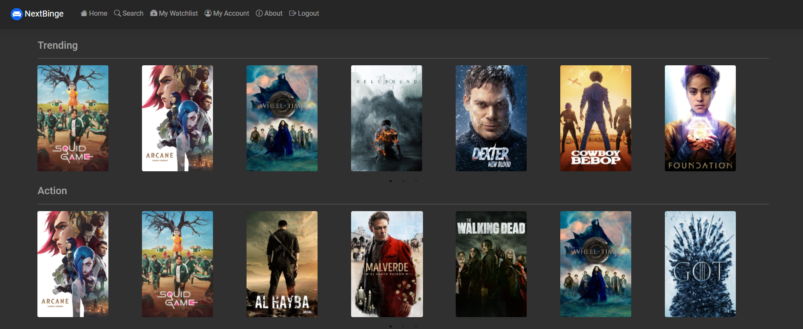

<p align="right">(<a href="#top">back to top</a>)</p>

### Built With

* [React.js](https://reactjs.org/)
* [JavaScript](https://www.javascript.com/)
* [Bootstrap](https://getbootstrap.com)
* [Material Design Bootstrap](https://mdbootstrap.com/docs/b5/react/)
* [React Bootstrap](https://react-bootstrap.github.io/)
* [Python](https://www.python.org/)
* [Django](https://www.djangoproject.com/)
* [Django REST Framework](https://www.django-rest-framework.org/)
* [MySQL](https://www.mysql.com/)
* [The Movie Database API](https://developers.themoviedb.org/3/getting-started/introduction)
* [Movie of the Night API](https://rapidapi.com/movie-of-the-night-movie-of-the-night-default/api/streaming-availability)

<p align="right">(<a href="#top">back to top</a>)</p>


<!-- GETTING STARTED -->
## Getting Started

To get a local copy up and running follow these simple example steps.

### Prerequisites

* Clone the backend repository and follow the instructions located [here](https://github.com/nhawks/nextbinge-capstone-backend). 

* npm
  ```sh
  npm install npm@latest -g
  ```

### Installation

# Getting Started with Create React App

This project was bootstrapped with [Create React App](https://github.com/facebook/create-react-app).

## Available Scripts

In the project directory, you can run:

### `npm start`

Runs the app in the development mode.\
Open [http://localhost:3000](http://localhost:3000) to view it in the browser.

The page will reload if you make edits.\
You will also see any lint errors in the console.

## Learn More

You can learn more in the [Create React App documentation](https://facebook.github.io/create-react-app/docs/getting-started).

To learn React, check out the [React documentation](https://reactjs.org/).


1. Get API keys at:
   * [TMDB API](https://developers.themoviedb.org/3/getting-started/introduction)
   * [Rapid API: Movie of the Night (Streaming Availability)](https://rapidapi.com/movie-of-the-night-movie-of-the-night-default/api/streaming-availability)
2. Clone the repo
   ```sh
   git clone https://github.com/nhawks/nextbinge-capstone-frontend.git
   ```
3. Install NPM packages
   ```sh
   npm install
   ```
4. In the 'src' folder create a file `key.js` enter your API keys in `key.js` 
   ```js
   export const RAPID_API_KEY = 'ENTER YOUR API';
   export const TMDB_API_KEY = 'ENTER YOUR API';
   ```


<p align="right">(<a href="#top">back to top</a>)</p>


<!-- USAGE EXAMPLES -->
## Usage

## Search by Genre
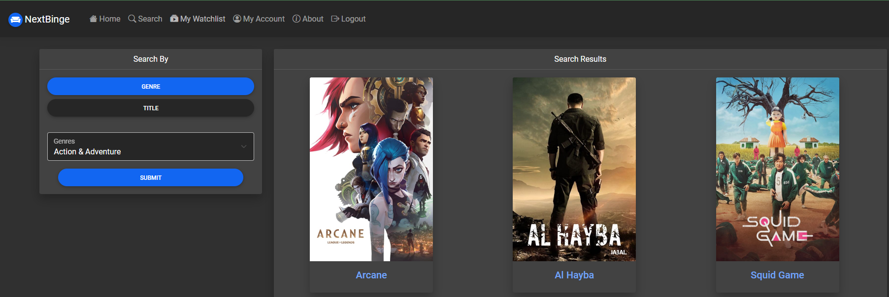
<p align="right">(<a href="#top">back to top</a>)</p>

## Search by Title
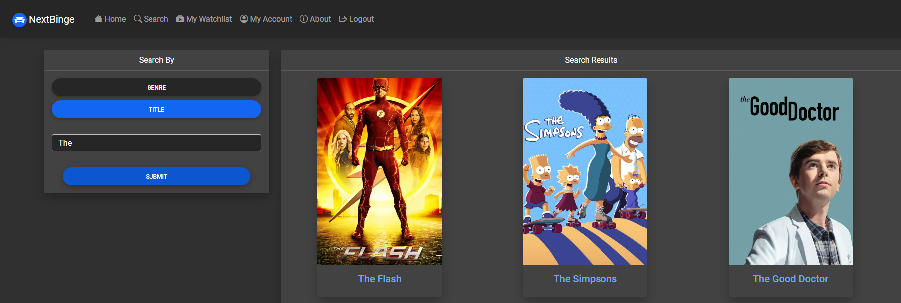
<p align="right">(<a href="#top">back to top</a>)</p>

## View the TV Show's details
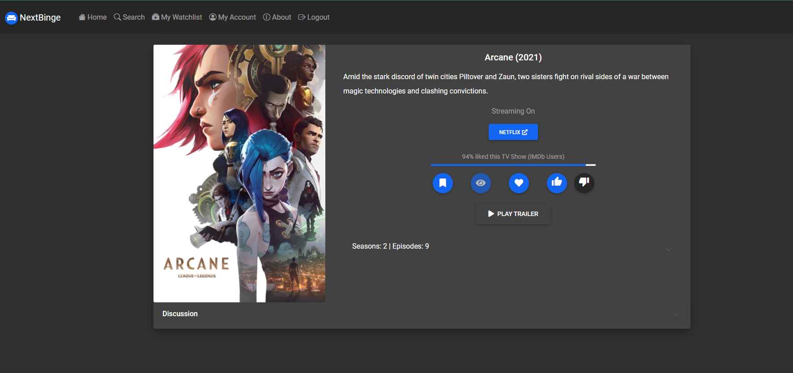
<p align="right">(<a href="#top">back to top</a>)</p>

## Play Trailer
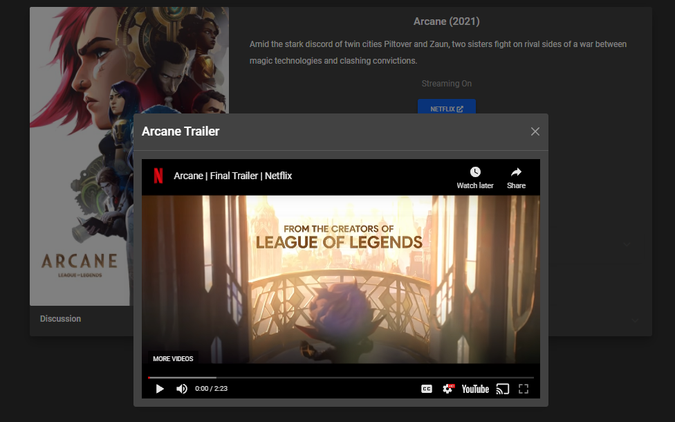
<p align="right">(<a href="#top">back to top</a>)</p>

## Season Information
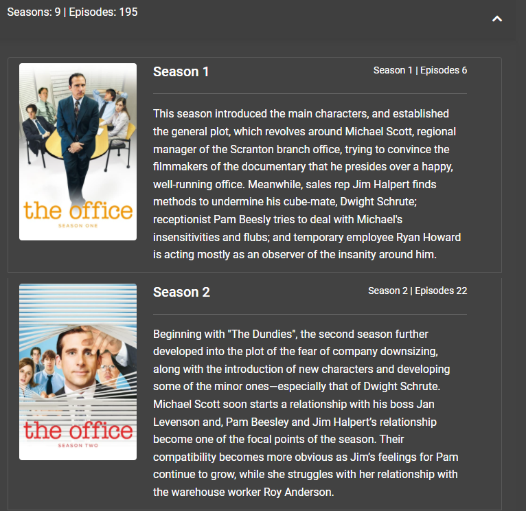
<p align="right">(<a href="#top">back to top</a>)</p>

## Discuss the show with others!
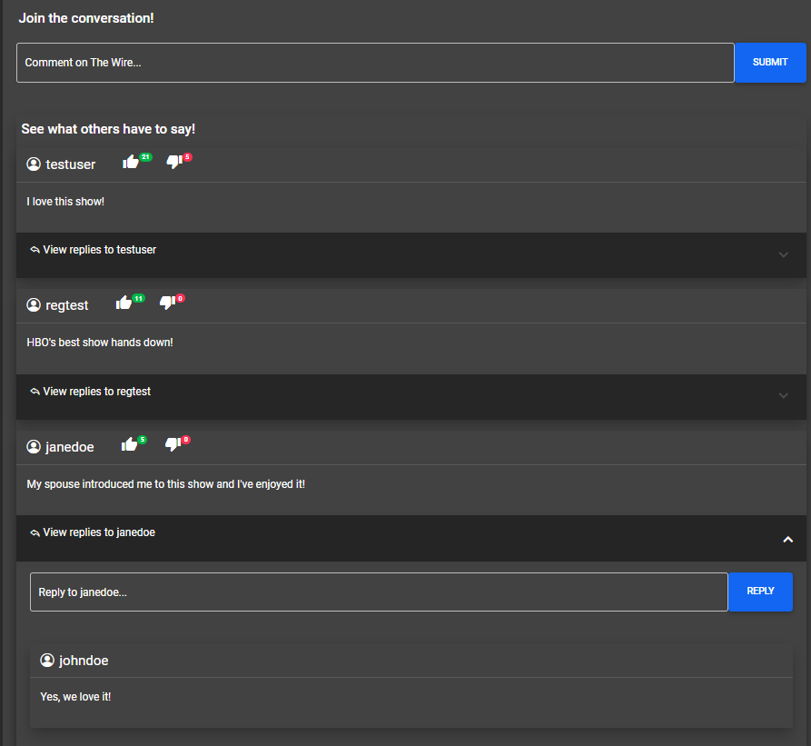
<p align="right">(<a href="#top">back to top</a>)</p>

## My Watchlist
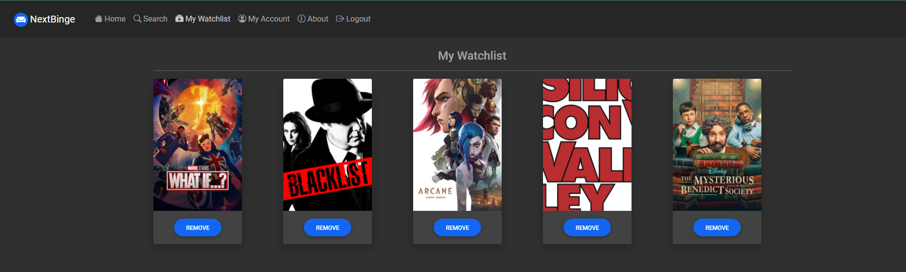
<p align="right">(<a href="#top">back to top</a>)</p>

## My Favorites
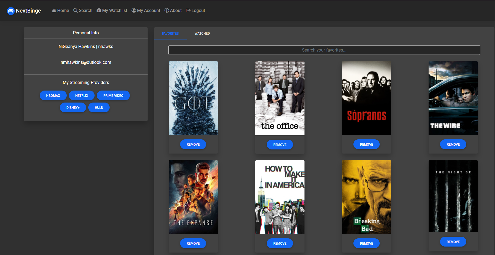
<p align="right">(<a href="#top">back to top</a>)</p>


## Watched Shows Table
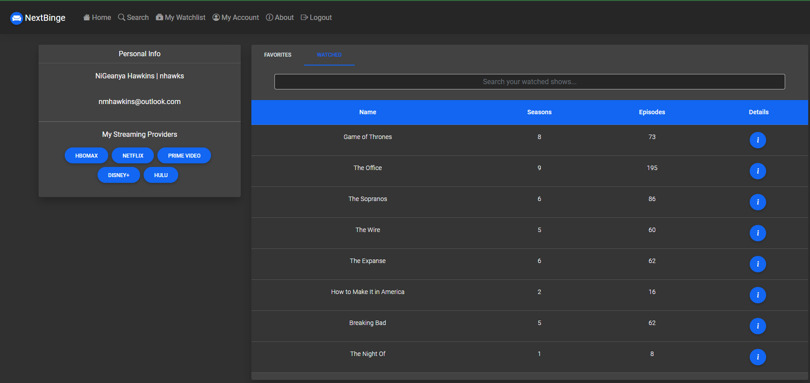
<p align="right">(<a href="#top">back to top</a>)</p>


## Mobile Friendly
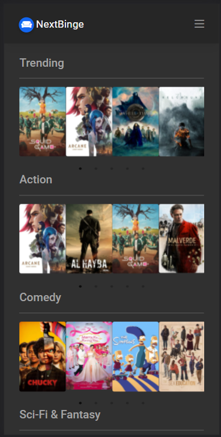
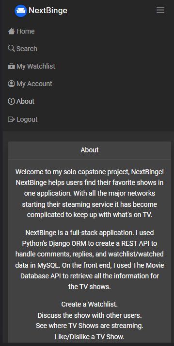
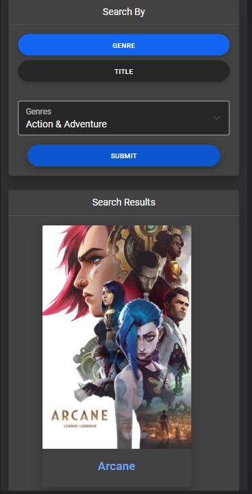
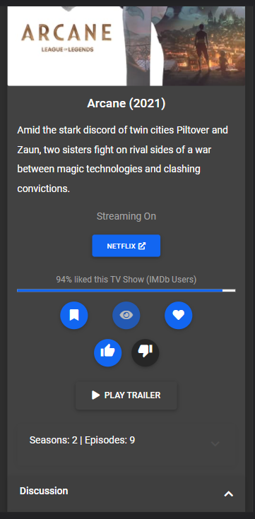
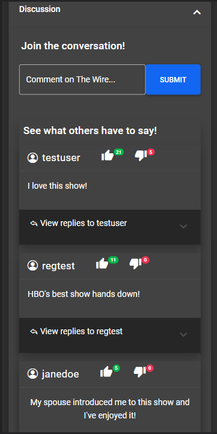
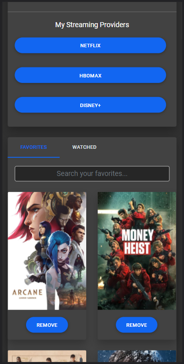
<p align="right">(<a href="#top">back to top</a>)</p>

## About NextBinge
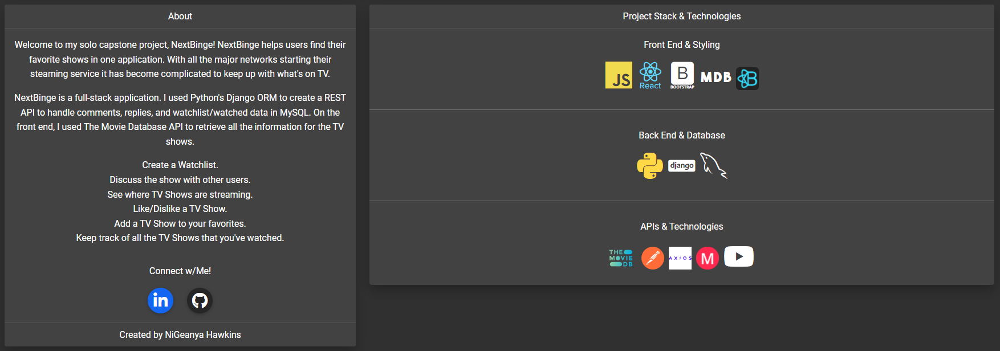


_For more examples, please refer to the [Project Video Demo](https://vimeo.com/648685904?embedded=true&source=video_title&owner=41163184)_

<p align="right">(<a href="#top">back to top</a>)</p>


<!-- CONTACT -->
## Contact

NiGeanya Hawkins - nmhawkins@outlook.com


<!-- MARKDOWN LINKS & IMAGES -->
[contributors-shield]: https://img.shields.io/github/contributors/nhawks/nextbinge-capstone-frontend.svg?style=for-the-badge
[contributors-url]: https://github.com/nhawks/nextbinge-capstone-frontend/graphs/contributors
[linkedin-url]: https://linkedin.com/in/nmhawkins
[product-screenshot]: (./project-images/NextBinge.png)


